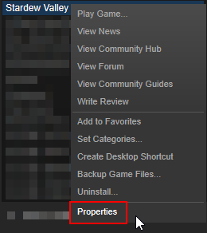
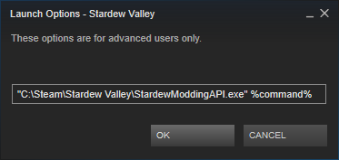

<div class="scroll-box" style="float: right;">
    <strong>For players</strong>
    <ul>
        <li><a href="/for-players/intro">Intro</a></li>
        <li><strong>Install SMAPI</strong></li>
        <li><a href="/for-players/use-mods">Use mods</a></li>
        <li><a href="/for-players/faqs">Troubleshooting & FAQs</a></li>
    </ul>
</div>

SMAPI is the tool which launches the game with mods (which are [downloaded separately](#using-mods)).
It's safely installed alongside your normal game, and you can uninstall it anytime. To update SMAPI,
just install the latest version.

## Automatic install
### On Windows
#### Part 1: install SMAPI
1. Download the [latest version of SMAPI](https://github.com/Pathoschild/SMAPI/releases).
2. Extract the `.zip` file somewhere (but not in your game folder!).
3. Double-click `install.exe`, and follow the on-screen instructions.  
   _The installer will detect your game and add SMAPI for you._

From now on, just run `StardewModdingAPI.exe` in [your game folder](http://canimod.com/for-players/faqs#game-folder)
to play with mods. To remove SMAPI later, just run `install.exe` again and choose _uninstall_.

#### Part 2: configure Steam
If you use Steam, you can launch SMAPI from the Steam client to enable the Steam overlay and
achievements. This requires a few more steps.

1. In the Steam client, right-click on _Stardew Valley_ and choose _Properties_:

   > 

2. Click _General > Set Launch Options_:

   > 

3. In the textbox, enter this text exactly as shown:

   ```"\StardewModdingAPI.exe" %command%```

4. Open [your game folder](http://canimod.com/for-players/faqs#game-folder), select the full
   address, and press `CTRL` + `C` to copy it. (Your path is probably different; that's fine.)

   > 

5. In the textbox right before `\`, press `CTRL` + `V` to paste the address. The textbox should now
   look something like this:

   > 

6. Click OK to save your changes.
7. From now on, just launch the game through Steam to run SMAPI with the Steam overlay and
   achievements.

### On Linux
1. Download the [latest version of SMAPI](https://github.com/Pathoschild/SMAPI/releases).
2. Extract the `.zip` file somewhere (but not in your game folder!).
3. Open a terminal in the extracted folder and run `mono install.exe`.  
   _The installer will detect your game and add SMAPI for you. (If you get an error like
   'mono: command not found', you need to install [Mono](http://www.mono-project.com/).)_

That's it! Just launch the game to play with mods. To remove SMAPI later, run `mono install.exe`
again and choose _uninstall_.

### On Mac
1. Download the [latest version of SMAPI](https://github.com/Pathoschild/SMAPI/releases).
2. Extract the `.zip` file somewhere (but not in your game folder!).
3. Open a terminal in the extracted folder and run `mono install.exe`.  
   _Here's how: (1) open the Terminal app; (2) type `mono` then a space; (3) drag & drop the
   `install.exe` file onto the Terminal window to paste its file path; (4) press enter on your
   keyboard._  
   _(If you get an error like 'mono: command not found', you need to install
   [Mono](http://www.mono-project.com/) first.)_

That's it! Just launch the game to play with mods. To remove SMAPI later, run `mono install.exe`
again and choose _uninstall_.

## Manual install
The installer is the recommended way to install SMAPI, but you can also install it manually.

1. Download the [latest version of SMAPI](https://github.com/Pathoschild/SMAPI/releases).
2. Unzip the `.zip` file somewhere.
3. Copy the files from the `internal/Mono` folder (if Linux/Mac) or `internal/Windows` folder (if
   Windows) into [your game folder](http://canimod.com/for-devs/faqs#game-folder). If you did it
   properly, the `StardewModdingAPI.exe` file should be right next to the game's executable.
4. Make sure the game launches with SMAPI.
   * **Scenario A: you play on Windows:**  
     See [part 2 in the Windows instructions](#on-windows).
   * **Scenario B: you play on Linux or Mac:**  
     1. Open the game folder.
     2. Rename the `StardewValley` file (with no extension) to `StardewValley-original`.
     3. Rename the `StardewModdingAPI` file (with no extension) to `StardewValley`.

<div class="scroll-box" style="display: inline-block;">
<big><strong>next:</strong> <a href="/for-players/use-mods">Use mods →</a></big>
</div>
